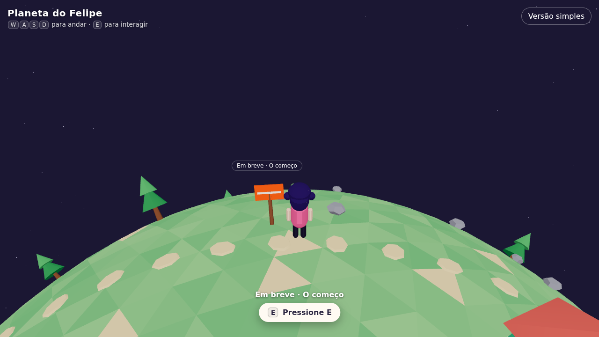

# Aika World 🪐

O planeta de **Felipe Kenji "Nakamura"** em 3D: seus projetos, serviços e história, com a
**Aika**, a agente de IA criada por ele, como guia. Cada casinha é um repositório do GitHub de
[@oyaga](https://github.com/oyaga). No templo japonês, o Felipe dá as boas-vindas e explica o mundo, e a
caixa de correio ao lado reúne todos os contatos; na Praça dos Serviços, um NPC na porta de cada prédio explica o serviço; e, na Trilha da história, o Felipe de cada época conta um capítulo da vida
dele.
Inspirado em
[messenger.abeto.co](https://messenger.abeto.co/).



## Como jogar

| Ação                   | Teclado              | Toque                     |
| ---------------------- | -------------------- | ------------------------- |
| Andar para frente/trás | `W` / `S` ou `↑` `↓` | Joystick (canto inferior) |
| Virar                  | `A` / `D` ou `←` `→` | Joystick                  |
| Correr                 | `Shift` (segurado)   | Joystick até a borda      |
| Pular                  | `Espaço`             | Botão "Pular"             |
| Nadar                  | entre num lago fundo | entre num lago fundo      |
| Interagir / conversar  | `E`                  | Botão "Toque para abrir"  |
| Emotes                 | `1`–`4`              | Botões 👋 🎉 ❤️ 😂        |
| Fechar painel          | `Esc`                | ✕ no painel               |

O botão **Versão simples** (canto superior direito) mostra todo o conteúdo em uma lista HTML
acessível, sem 3D. A animação respeita `prefers-reduced-motion`.

## Stack

- **Monorepo** com pnpm workspaces e TypeScript `strict` em tudo
- **Web** (`apps/web`): Vite, React 19, [@react-three/fiber](https://r3f.docs.pmnd.rs/),
  [@react-three/drei](https://drei.docs.pmnd.rs/), three.js e zustand
- **Servidor** (`apps/server`): Cloudflare Worker + Durable Object (esqueleto para o multiplayer)
- **Compartilhado** (`packages/shared`): tipos do mundo e do protocolo WebSocket
- ESLint (flat config, typescript-eslint, react-hooks) + Prettier; CI no GitHub Actions

## Estrutura

```
aika-world/
├── apps/
│   ├── web/                    # Cliente 3D (Vite + React + R3F)
│   │   ├── public/world.json   # Dados do mundo (gerado por `pnpm world`)
│   │   └── src/
│   │       ├── world/          # Planet, Player, Companion (Aika), Characters, Houses, NPCs, CameraRig...
│   │       ├── ui/             # Panel, Hint, Joystick, Loading, SimpleView
│   │       ├── state/          # store (zustand), entrada, estado do jogador
│   │       ├── lib/sphere.ts   # Matemática na esfera (quaternions, Fibonacci, RNG)
│   │       ├── lib/models.ts   # Descobre os .glb disponíveis
│   │       ├── assets/models/  # Modelos .glb do Blender (ver docs/arte.md)
│   │       └── content.tsx     # Textos (na voz da Aika), serviços, contatos e a Trilha da história
│   └── server/                 # Cloudflare Worker + Durable Object `World` (salas multiplayer)
├── packages/shared/            # Tipos: WorldData, RepoHouse, mensagens do protocolo
├── scripts/generate-world.mjs  # Gera world.json a partir da API do GitHub
├── docs/arte.md                # Guia para modelar e exportar do Blender
├── docs/deploy.md              # Como colocar no ar (Cloudflare + GitHub Actions)
├── scripts/check-models.mjs    # Confere os .glb (nomes, animações, triângulos, tamanho)
└── .github/workflows/ci.yml    # install → typecheck → lint → build
```

## Como rodar

Requisitos: Node 20+ e pnpm (`corepack enable`).

```bash
pnpm install
pnpm dev          # abre o cliente em http://localhost:5173
pnpm typecheck    # checagem de tipos em todos os pacotes
pnpm lint         # ESLint
pnpm build        # build de produção (apps/web/dist)
pnpm models:check # confere os .glb contra o guia de arte (docs/arte.md)
```

### Multiplayer (opcional)

Sem servidor, o planeta funciona sozinho. Para ver outros visitantes ao vivo:

```bash
pnpm --filter @aika-world/server dev     # servidor local em http://localhost:8787
cp apps/web/.env.example apps/web/.env    # e descomente VITE_WORLD_URL=ws://localhost:8787/world
pnpm dev                                  # abra em duas abas para se ver andando
pnpm --filter @aika-world/server smoke    # teste de fumaça do protocolo (com o servidor rodando)
```

Publicando: um único Worker da Cloudflare serve o site e o multiplayer no mesmo endereço, com
deploy automático pelo GitHub Actions. Passo a passo em [`docs/deploy.md`](docs/deploy.md)
(`pnpm preview:prod` roda igual à produção em http://localhost:8787).

Como funciona: cada sala é um Durable Object `World` com WebSockets em modo de hibernação
(conexões paradas não custam nada). O servidor dá a cada visitante um nome ("Viajante #427") e uma
cor, repassa só a orientação (quaternion) e a velocidade de cada um, valida tudo o que chega e
limita mensagens por conexão. Cabem 50 visitantes por sala; acima disso o cliente vai para a
próxima (até 5). O protocolo fica em `packages/shared/src/protocol.ts`.

### Gerando o mundo a partir do GitHub

```bash
pnpm world                          # repositórios públicos de "oyaga"
GITHUB_USER=outra-pessoa pnpm world # outro usuário
GITHUB_TOKEN=ghp_xxx pnpm world     # inclui repositórios privados (anonimizados)
```

Repositórios **privados** nunca têm nome, descrição ou URL expostos: viram casas secretas
(`{ "secret": true, ... }`, cinzas e com 🔒), mostrando apenas linguagem, estrelas e data da
última atividade. O `world.json` versionado é uma semente com dois repositórios públicos e
quatro casas secretas.

## Como funciona

- **Caminhar na esfera**: o visitante (um Viajante com roupa de cor sorteada) é controlado pelo
  teclado ou joystick; sua orientação é um único quaternion. O "up" local é a normal da
  superfície e a posição é sempre `up × raio` (gravidade implícita, sem física). Andar é uma
  rotação em torno do eixo X local; virar, em torno do Y local.
- **Câmera**: terceira pessoa, atrás e acima no referencial local, suavizada com `lerp`/`slerp`.
- **Casas**: distribuídas com uma esfera de Fibonacci; altura por `log(estrelas + 1)` + atividade
  recente; cor pela linguagem.
- **Pular, correr e nadar**: sem biblioteca de física. A gravidade puxa para o centro do planeta
  (`world/locomotion.ts`); Espaço pula, Shift corre (no celular, joystick até a borda + botão
  de pulo) e, na água funda dos lagos, o personagem nada e respinga ao cair. Os lagos do planeta
  procedural ficam em `world/lakes.ts`; com `planeta.glb`, são os meshes `agua_*`.
- **Aika, a guia**: anda ao lado do visitante (acelera quando fica para trás), fala o nome e a
  descrição de cada repositório quando ele chega perto e, de tempos em tempos, solta um
  comentário aleatório num balão sobre a cabeça. As falas ficam em `src/guide.ts`.
- **NPCs e conversas**: `src/dialogues.ts` define as conversas como pequenos grafos (falas +
  opções de resposta); a do Felipe é escrita à mão e as dos serviços e da história são geradas a
  partir de `SERVICES` e `STORY` em `content.tsx`. A caixa de diálogo digita as falas, aceita E/Espaço/Enter para
  avançar e 1–9 para escolher. Os NPCs se viram para o visitante quando ele chega perto.
- **Árvores e pedras**: posicionamento determinístico (RNG com semente) e `InstancedMesh`.
- **Modelos 3D**: cada `.glb` em `apps/web/src/assets/models/` substitui a forma simples
  correspondente (com fallback se faltar ou falhar) e ganha materiais cartoon. Com `planeta.glb`,
  os personagens seguem o relevo e os Empties `poi_*`, `area_vila` e `bloqueio_*` definem marcos, vila e
  barreiras. Detalhes em [`docs/arte.md`](docs/arte.md).

## Roadmap

1. **Protótipo** ✅ — planeta, visitante andando com a Aika de guia, câmera, pontos de interesse, painéis, versão simples.
2. **Multiplayer** ✅ — Cloudflare Durable Objects + WebSocket: visitantes ao vivo, nomes, cores e
   emotes. Deploy pronto (falta configurar a conta Cloudflare, ver docs/deploy.md).
3. **Commits ao vivo** — GitHub App enviando eventos de push; casas reagem em tempo real.
4. **Arte** 🚧 — carregamento dos `.glb` pronto; modelos no Blender (Aika em `.glb` com animações) e shader cartoon próprio.
5. **Conteúdo e acabamento** — textos finais, versão 2D completa, som, SEO e performance.
